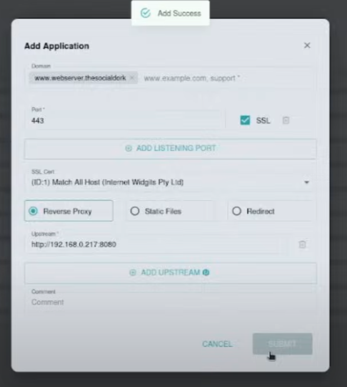
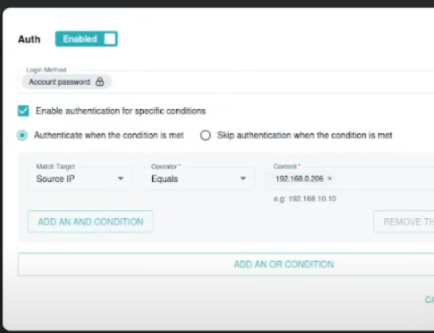
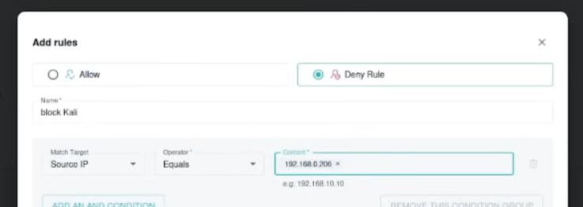
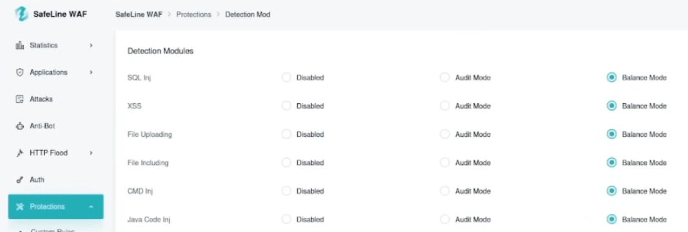
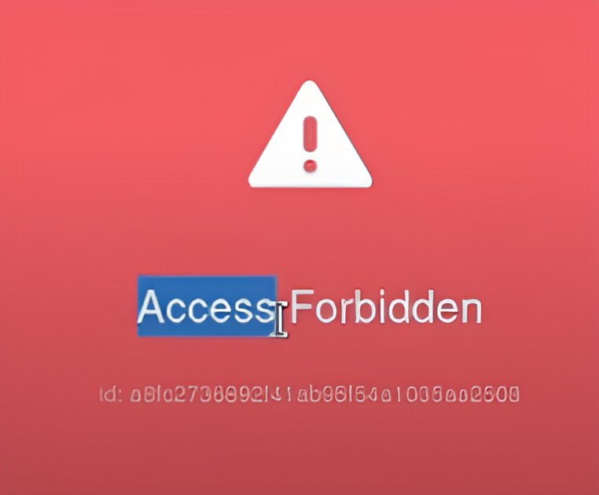

# 🛡️ Web Application Firewall (WAF) Lab: Protecting DVWA with SafeLine

---

## 📖 Overview
This project documents my hands-on lab setup for learning **web application security** by:
1. Deploying **Damn Vulnerable Web App (DVWA)** on an Ubuntu server.
2. Simulating attacks (e.g., SQL injection) from Kali Linux.
3. Configuring **SafeLine WAF** to detect and block attacks.
4. Testing advanced WAF features like rate limiting and IP blocking.

**Goal:** Understand how WAFs work in real-world scenarios by building a controlled lab environment.

---

## 🛠️ Lab Setup Guide

### 🔧 **1. Prerequisites**
- **Hardware:**  
  - 8GB+ RAM, 50GB+ disk space.  
- **Software:**  
  - VirtualBox ([Download](https://www.virtualbox.org/wiki/Downloads))  
  - Kali Linux ISO ([Download](https://www.kali.org/get-kali))  
  - Ubuntu Server ISO ([Download](https://ubuntu.com/download/server))  

---

### 🖥️ **2. Virtual Machine Setup**
#### **Install VirtualBox**
- Create two VMs:  
  - **Kali Linux** (Attacker)  
  - **Ubuntu Server** (Hosts DVWA + WAF)  

### 🖥️ **3. Virtual Lab Network Configuration**

#### 🌐 Network Verification Between Kali Linux and Ubuntu Server

This section confirms successful network connectivity between our two virtual machines - the **Kali Linux attacker** and **Ubuntu Server target**.

### 🔍 Verification Steps

1. **Ran `ifconfig` on both VMs** to check IP addresses
2. **Confirmed they're on the same subnet** (192.168.0.x in this case)
3. **Verified bidirectional ping** between systems

### 📸 Network Configuration

| Kali Linux (Attacker) | Ubuntu Server (Target) |
|-----------------------|------------------------|
|  |  |

**Key Observations:**
- Both systems show **eth0** interfaces with active connections
- IP addresses are in the same range (`192.168.0.206` vs `192.168.0.217`)
- Subnet masks match (`255.255.255.0`)
- RX/TX packets show active network traffic

### ✅ Connectivity Test
```bash
# From Kali to Ubuntu:
ping 192.168.0.217

# From Ubuntu to Kali:
ping 192.168.0.206
```
## 🛡️ 4. SafeLine WAF Deployment


Deploying SafeLine WAF is a straightforward process completed via command line. The web-based dashboard then provides comprehensive security monitoring and configuration options.

### Installation Process
First, we run the official one-line installer in our Ubuntu Server terminal:


The installation process automatically downloads and verifies all required components. Upon successful download, you'll see confirmation in the terminal:


### Dashboard Access
Once installed, access the SafeLine web interface at `https://<your-server-ip>:9443`. The dashboard provides:


- Real-time traffic monitoring
- Security event alerts
- WAF rule configuration
- System health metrics


## 🌐 5. Local DNS Configuration

For simplicity, we'll configure local DNS resolution by editing the `/etc/hosts` file rather than setting up a full DNS server. This approach is perfect for lab environments focused on WAF testing.

### Hosts File Modification
On both Kali (attacker) and Ubuntu (target) machines:


*Mapping `192.168.0.217` to `webserver.socialdork` in Ubuntu*


*Consistent mapping ensures both systems resolve the same domain*

```bash
# Edit hosts file on both systems:
sudo nano /etc/hosts

# Add this line (replace IP with your Ubuntu server's IP):
192.168.0.217 webserver.socialdork
```
## 🖥️ 6. DVWA Installation & Configuration

Refer to the complete installation guide in [WAF-Lab-Guide.pdf](WAF.pdf) for detailed steps. Key configuration points:

### Apache Verification
  
*Confirming DVWA listens on port 8080 through:*
```bash
cat /etc/apache2/sites-enabled/dvwa.conf
```

## 🔐 7. Configuring SafeLine WAF for DVWA

### Accessing the WAF Dashboard
After successful installation, access the SafeLine web interface through your browser:


*Default credentials are provided in the terminal output after installation*

### Adding DVWA as a Protected Application
1. Navigate to "Web Protection" → "Sites"
2. Click "Add Site" and enter your DVWA details:


*Configuration includes:*
- Domain: `webserver.socialdork`
- Backend server: `http://localhost:8080`
- Protocol: HTTP (will upgrade to HTTPS after certificate setup)

---

## 📜 8. SSL Certificate Configuration

### Generating Certificate Signing Request (CSR)
First, we create a private key and CSR using OpenSSL:


```bash
openssl req -new -newkey rsa:2048 -nodes -keyout priv.key -out priv.csr
```
### Creating Self-Signed Certificate
Using the generated CSR to create a certificate:


```bash
openssl x509 -req -days 365 -in priv.csr -signkey priv.key -out priv.crt
```
Uploading Certificate to SafeLine
Navigate to "System" → "Certificate"

Upload both the certificate and private key:


Key points:

Certificate file: priv.crt

Private key: priv.key

Set as default certificate

Enabling HTTPS for DVWA
Finally, update the DVWA site configuration to use HTTPS:



Now accessible at:
https://webserver.socialdork/DVWA

## 9. Security Features

This section demonstrates a few key security measures implemented to protect the internal systems and services of the fictional Artisanal Widget Co. Below are the features configured and tested.

---

### 🔒 HTTP Flood Protection

To prevent denial-of-service-style abuse, HTTP flood protection was configured. When more than **3 requests are received within 10 seconds** from the same client, the IP is temporarily **blocked for 5 minutes**.

- This simulates basic DoS/DDoS prevention.
- Useful in environments where repeated requests could strain the system or indicate malicious probing.

**Screenshot:**


---

### 🔐 Web Page Access via Authentication (for Kali Machine IP)

Access to internal web pages was restricted using an authentication mechanism. Only authenticated users can interact with the system.

- Access attempt was made from a Kali Linux machine.
- A login prompt ensures only authorized users can proceed.

**Screenshots:**

  


---

### 🚫 Blocking Unauthorized Access (Kali Machine IP)

To simulate handling of a suspicious machine (in this case, a Kali Linux system used for testing), an access rule was created to **explicitly block its IP address** from reaching the web server.

- Demonstrates network-based access control.
- Useful for blacklisting known hostile endpoints.

**Screenshots:**

  


---

### 🛡️ Web Application Attack Protection (e.g., SQL Injection)

A simple test page was configured to simulate common web application vulnerabilities. Security controls were applied to mitigate attacks like SQL injection.

- Demonstrates input validation and error handling.
- A common attack string was blocked and logged.

**Screenshots:**

  
  


